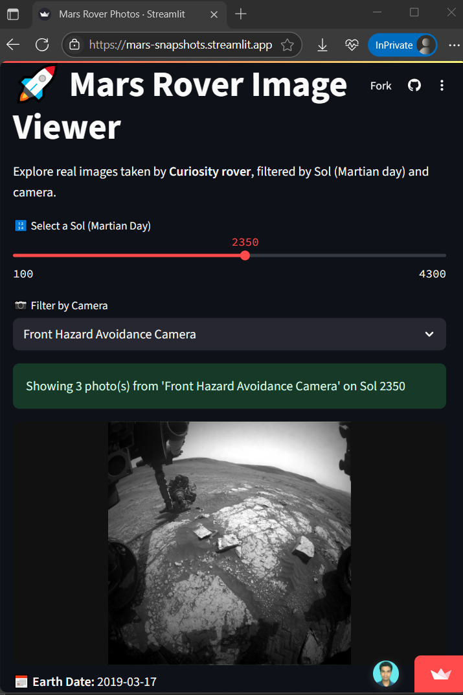

# 🚀 Mars Rover Image Viewer

Explore stunning real images from NASA's **Curiosity Rover** on Mars!  
This interactive Streamlit app lets you filter photos by **Sol (Martian day)** and **camera**, and view rich metadata from the mission.



---

## 🌌 Features

- Select **Sol** using a slider (from 100 to 4300)
- Filter images by camera type
- View up to 3 photos with:
  - High-res previews
  - Metadata (date, rover, camera info)
  - Fullscreen view button
- Uses the Nebulum Mars Rover API (a working community mirror of NASA’s archived API)

---

## 🛰️ Try it Live

👉 [Open App](https://mars-snapshots.streamlit.app/)

---

## 🚀 Run Locally

```bash
git clone https://github.com/ravi18kumar2021/mars-snapshots.git
cd mars-snapshots
pip install -r requirements.txt
streamlit run app.py